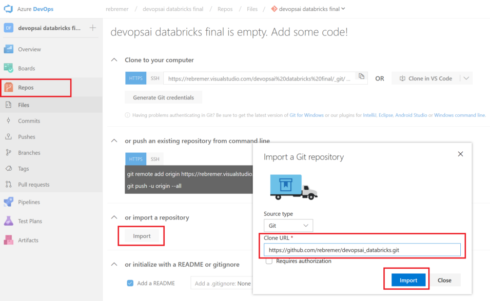
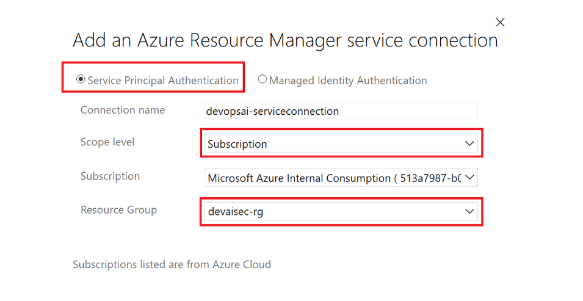
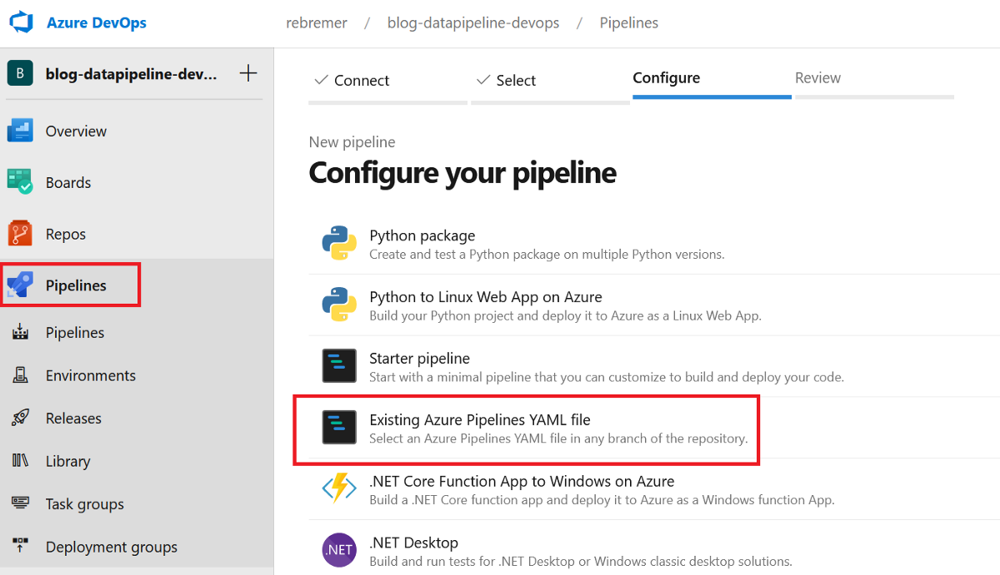
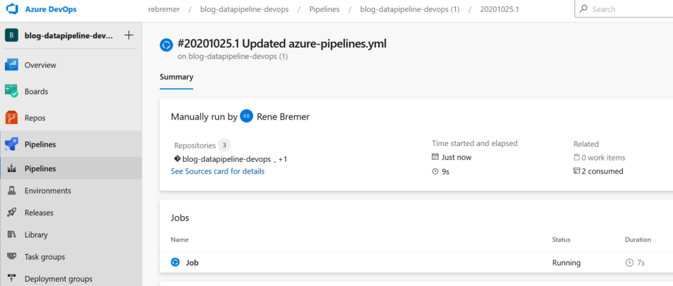
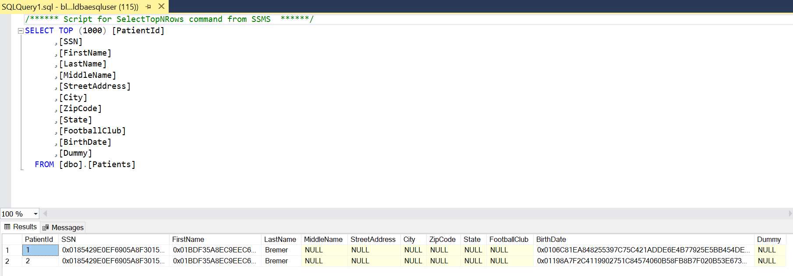

# Azure DevOps project to publish DACPAC to Azure SQL with Always Encrypted 

*TLTR: Create Azure DevOps project using azure-pipelines.yml, publish 1st DACPAC to SQLDB, add data to table, publish 2nd DACPAC to SQLDB creating encrypted columns and data*

Main properties of project:

-	Key material (CMK, CEK) is set outside of DACPAC using PowerShell. This enables deployment of DACPAC to multiple environments 
-	Azure DevOps pipeline is idempotent. That is:
    - Infrastructure and DACPAC is deployed, record is added to table, three columns are encrypted by publishing new DACPAC. These steps can be executed N times.

To achieve this, the following is done:

-	DACPAC is filled with dummy values of CMK and CEK, see [here](https://github.com/rebremer/blog-sqldbalwaysencrypted-git/blob/master/data/testdacpacsql-unencrypted/model.sql#L504) and [here](https://github.com/rebremer/blog-sqldbalwaysencrypted-git/blob/master/data/testdacpacsql-unencrypted/model.sql#L511). 
- Command line tool SqlPackage.exe is instructed to ignore the CMK and CEK from the DACPAC while publishing, see [here](https://github.com/rebremer/blog-sqldbalwaysencrypted-git/blob/master/deploymentscript/4_deploy_dacpac_encrypted.ps1#L18). 
- Although CMK is filled with a dummy reference to a key vault key, the key must exist in the key vault. For that purpse, a dummy key is created as part of the key creation script, see [here](https://github.com/rebremer/blog-sqldbalwaysencrypted-git/blob/master/deploymentscript/1_create_cmk_cek_akv.ps1#L39). 

The following steps will be executed:

0. Setup Azure DevOps CI/CD project 
1. Create build artifact containing all scripts and deploy resources in release pipeline
2. Run scripts that does the following:
   - Deploy database and key vault
   - Create CMK/CEK in key vault and database
   - Publish 1st DACPAC in which only a dummy column is encrypted
   - Add data to table
   - Publish 2nd DACPAC that encrypts 4 columns. Part of the processe is encrypting data that is already part of the pipeline
3. Rerun script to test idempotency

## 0. Setup Azure DevOps CI/CD project 

In this chapter, the project comes to live and the modern data pipeline using architecture described in chapter B.
- 0.1 Prerequisites
- 0.2 Create Azure DevOps project
- 0.3 Create Service connection
- 0.4 Configure and build/release YAML pipeline

### 0.1 Prerequisites

The following resources are required in this tutorial:

- [Azure Account](https://azure.microsoft.com/en-us/free/)
- [Azure DevOps](https://azure.microsoft.com/en-us/services/devops/)
- [Azure CLI](https://docs.microsoft.com/en-us/cli/azure/install-azure-cli?view=azure-cli-latest) (recommended, also for troubleshooting)

Subsequently, go to the Azure portal and create a resource group in which all Azure resources will be deployed. This can also be done using the following Azure CLI command:

```azurecli-interactive
az group create -n <<your resource group>> -l <<your location>>
```

### 0.2 Create Azure DevOps project

Azure DevOps is the tool to continuously build, test, and deploy your code to any platform and cloud. Create a new project in Azure DevOps by following [this](https://docs.microsoft.com/en-us/azure/devops/organizations/projects/create-project?view=azure-devops&tabs=preview-page&viewFallbackFrom=vsts) tutorial. Once you create a new project, click on the repository folder and select to import the following repository:

- https://github.com/rebremer/blog-sqldbalwaysencrypted-git

See also picture below. 


### 0.3 Create Service connection

A Service connection is needed to access the resources in the resource group from Azure DevOps. Go to project settings, service connection and then select Azure Resource Manager. Select Service Principal Authentication and limit scope to your resource group which you created earlier, see also picture below.



### 0.4 Configure and build/release YAML pipeline

Go to your Azure DevOps project, select Pipelines and then click “New pipeline”. Go to the wizard, select the Azure Repos Git and the git repo you created earlier. In the tab configure, choose “Existing Azure Pipelines YAML file” and then azure-pipelines.yml that can be found in the git repo, see also below.



Subsequently, the following variables need to be substituted with your own values:

```
variables: 
  #
  # 1. Azure DevOps settings, change with your own
  AzureServiceConnectionId: 'blog-sqldbalwaysencrypted-servcon'
  SUBSCRIPTIONID: '<<your subscription id>>'
  #
  # 2. Unique environment variables,change it with your own
  SQLSERVER: 'blog-sqldbae-sqlvg<<your unique name>>'
  AKV: 'blogsqldbaeakvg<<your unique name>>'
```

Once the variables are substituted, the pipeline is created and run immediatelly, see below.



## 1. Verification 1: Check whether SQLDB and Key vault are deployed

In the first step of the Azure DevOps pipeline, SQLDB and AKV are deployed. After deployment is done, it can be verified using Azure CLI whether all resources are deployed.

```azurecli-interactive
az resource list -g <<your resource group>>
```

## 2. Verification 2: Check encrypted records in database

Pipeline can be rerun N times. After the Nth run, there shall be N records in the database, see screenshot below for second run



Between step 2_deploy_dacpac_unencrypted.ps1 and 3_add_data.ps1, all the data is unencrypted.